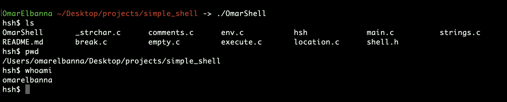

# Simple Shell Project  

Welcome to **Simple Shell**, a UNIX command-line interpreter developed as part of the ALX SE curriculum. This project provided an in-depth understanding of C programming, system calls, process management, and shell functionalities.  

Key features include:  
- Command execution with or without arguments  
- Environment variable management  
- Robust error handling  

<div style="display: flex; justify-content: center; align-items: center; flex-wrap: wrap;">
  
  
  
  
  
  
</div>  

## ALX Final Project Grade  
  

---

## Table of Contents  

1. [Background Context](#background-context)  
2. [Features](#features)  
3. [Requirements](#requirements)  
4. [Installation](#installation)  
5. [Usage](#usage)  

---

## Background Context  

The purpose of this project was to design and implement a basic shell that emulates some core functionalities of the standard UNIX shell. Through this project, I gained valuable insights into:  

- **C Programming Fundamentals**  
- **System Calls and Process Management**  
- **Shell Internals and Behavior**  

---

## Features  

1. **Command Execution**: Execute commands directly from the shell.  
2. **Arguments Handling**: Support for commands with and without arguments.  
3. **Environment Variables**: Basic handling using `env`.  
4. **Error Management**: Provides user feedback for invalid commands.  
5. **EOF Handling**: Proper handling of the "end of file" condition.  

---

## Requirements  

- Ubuntu 20.04 LTS  
- GCC with the following flags:  
  ```bash
  gcc -Wall -Werror -Wextra -pedantic -std=gnu89
  ```  

---

## Installation  

1. Clone the repository:  
   ```bash
   git clone https://github.com/zscbana/simple_shell.git
   ```  

2. Navigate to the project directory:  
   ```bash
   cd simple_shell
   ```  

3. Compile the shell:  
   ```bash
   gcc -Wall -Werror -Wextra -pedantic -std=gnu89 *.c -o hsh
   ```  

---

## Usage  

Run the shell in **interactive mode**:  
```bash
./hsh
```  

You can now execute UNIX commands from within the shell.  

---  

Feel free to contribute and improve this project!  

---